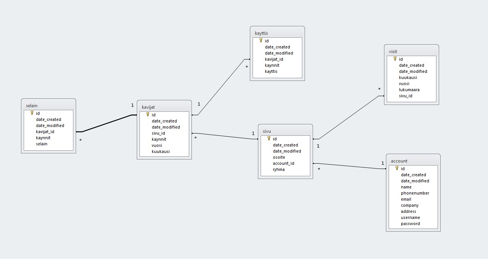

# Arkkitehtuurikuvaus

## Käyttäliittymä

Käyttöliittymä on luotu käyttäen hyväksi bootstrappia ja normaaleja html tagejä. Sivujen tyylityksestä kuitenkin hoitaa _layout.html_ sisältämä style-tagi, joka sisältää puhdasta css-koodia. Käyttöliitymä on pyritty kehityksen aikana pitämään mahdollisimman saavutettavana kaikenlaisille käyttäjille ja tämän vuoksi muun muassa kontrasteihin on panostettu värien valinnassa. 

Rakenteeltaan käyttöliittymä on myös suhteellisen yksinkertainen ja moniin paikkoihin pääsee yhdellä napautuksella, jos listausten ja yhteenvetojen lomake vaihetta ei lasketa. 

## Tietokanta

Sovellus käyttää paikallisesti sqlite tiedonhallinta järjestelmää, mutta muuten postgresql tietokantaa. Tietokanta näyttää vastaavalta



Tietokanta taulut on luotu seuraavilla kyselyillä

```
CREATE TABLE account(id INTEGER PRIMARY KEY, data_created TIMESTAMP, data_modified TIMESTAMP, name VARCHAR(144), phonenumber VARCHAR(144), email VARCHAR(144), company VARCHAR(144), address VARCHAR(144), username VARCHAR(144), password VARCHAR(144));
CREATE TABLE sivu(id INTEGER PRIMARY KEY, data_created TIMESTAMP, data_modified TIMESTAMP, osoite VARCHAR(144), account_id INTEGER, ryhma VARCHAR(144), FOREIGN KEY(account_id) REFERENCES account(id));
CREATE TABLE visit(id INTEGER PRIMARY KEY, data_created TIMESTAMP, data_modified TIMESTAMP, kuukausi INTEGER, vuosi INTEGER, lukumaara INTEGER, sivu_id INTEGER, FOREIGN KEY(sivu_id) REFERENCES sivu(id));
CREATE TABLE kavijat(id INTEGER PRIMARY KEY, data_created TIMESTAMP, data_modified TIMESTAMP, sivu_id INTEGER, kaynnit INTEGER, vuosi INTEGER, kuukausi INTEGER, FOREIGN KEY(sivu_id) REFERENCES sivu(id));
CREATE TABLE kayttis(id INTEGER PRIMARY KEY, data_created TIMESTAMP, data_modified TIMESTAMP, kavijat_id INTEGER, kaynnit INTEGER, kayttis VARCHAR(144), FOREIGN KEY(kavijat_id) REFERENCES kavijat(id));
CREATE TABLE selain(id INTEGER PRIMARY KEY, data_created TIMESTAMP, data_modified TIMESTAMP, kavijat_id INTEGER, kaynnit INTEGER, selain VARCHAR(144), FOREIGN KEY(kavijat_id) REFERENCES kavijat(id));
```

## Tiedostot

Toimivuuden ja jatkokehityksen kannalta tärkein tiedosto on [requirements.txt](https://github.com/Jhoneagle/TilastointiOhjelma/blob/master/requirements.txt). Sillä tämä sisältää tiedon kaikista python kirjastoista ja niiden varmasti toimivasta versiosta mitä ohjelma tarvitsee.

Jos sovellus laitetaan Herokuun niin tällöin oleellinen tiedosto on myös [Procfile](https://github.com/Jhoneagle/TilastointiOhjelma/blob/master/Procfile). Mikä sisältää tiedon siitö mikä python tiedosto toimii käynnistys tiedostona.

Manuaalista käynnistystä varten oleellinen python tiedosto kuitenkin on [runserver.py](https://github.com/Jhoneagle/TilastointiOhjelma/blob/master/runserver.py). Sillä _runserver.py_ sisältää aloitus kutsun sekä hostin määrityksen. Paikallisesti yleensä _https:\\localhost:5555_.

## Ohjelman heikkoudet sekä rajoitukset

* Ohjelma ei sivuta listauksia, kun on kyse suuresta määrästä dataa.
* Se ei myöskään sisällä takaisin painiketta vaikkakin se ei myöskään ole kaikialla edes välttämätön nopean uudelleen pääsyn takia. 
* Käynti tietoja ei pysty poistamaan.
* Mitään lisättyjä tetueita ei voi myöskään muokata, joten kävijä tietojen muokkaus tapahtuu poistamalla ja uudelleen lisäämällä. 