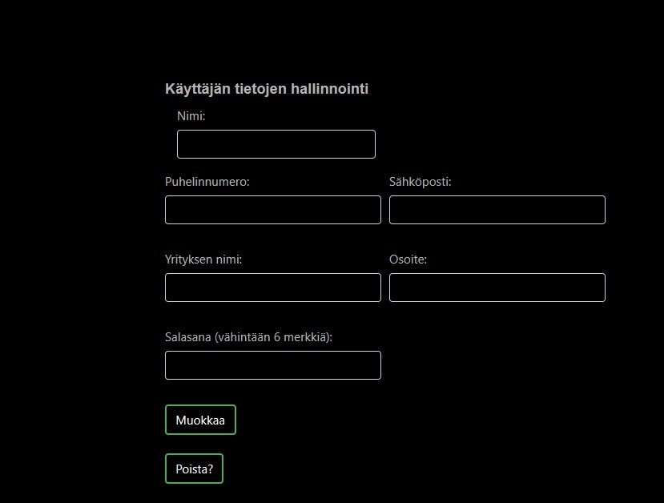
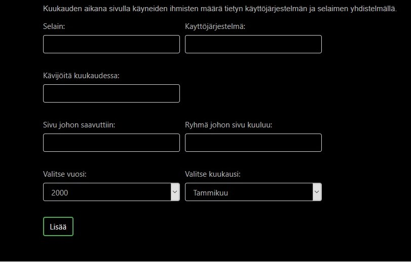

# Käyttöohje

Sovellus löytyy ainakin 30.5.2018 asti aktiivisena [herokusta](https://statistiikkaohjelma.herokuapp.com/).

## Kehitysympäristö

### asennus

Sovellus tarvitsee v3.5 tai versiota vastaavan Pythonin. Sovellus ajoa varten on tarve myös Pythonin venv virtuaaliympäristölle. Näiden ollessa kohdillaan tarvitsee enää asentaa pip kautta [requirements.txt](https://github.com/Jhoneagle/TilastointiOhjelma/blob/master/requirements.txt) määrittelemät kirjastot.

### konfigurointi

Sovellus on luotu mahdollisimman kehitysympäristö ja käyttöympäristö neutraaliksi, jolloin se tarvitsee mahdollisimman vähän manuaalista säätöä toimiakseen kaikilla alustoilla. Ohjelman käynnistystiedoston täytyy kuitenkin olla _runserver.py_. Herokulle ja muille, jotka käyttävät Procfilea on valmiiksi ohjelmalle määritelty [Sellainen](https://github.com/Jhoneagle/TilastointiOhjelma/blob/master/Procfile). 

## käyttö

Valtaosa ohjelman toiminnoista vaativat kirjautumisen itse kirjautumista ja rekistöröitymistä lukuunottamatta. Ainoa, joka tätä ei tarvitse on Käyttäjinä olevien yritysten listaus. 

### Rekistöröityminen

Lomake kysyy perustietoja käyttäjästä. Käyttäjänimen tosin pitää olla uniikki ja jos "rekistöröidy" nappi ei tunnu tekevän mitään tarkoittaa tämä, että käyttäjätunnus on varattu. Taas salasana ja sähköposti vaatii vähintään 6 merkkiä ja puhelinnumero 7. Muut kentät vaativat vain tekstiä.

### käyttäjän tietojen muokkaus

Kenttien vaatimukset vastaavat rekistöröitymislomakeen vaatimuksia. Erona se, että lomakeen auetessa järjestelmä syöttää kenttiin olemassa olevat nykyiset tiedot valmiiksi.

### Kuukausi tietueen lisäys sivulla käynneistä

Huom. Käynnit tässä tapauksess tarkoittavat sitä, kun kuka tahansa saapuu sivulle. Sillä onko hän ollut aiemmin samalla sivulla vai ei, ei ole mitään väliä. Suomeksi sitä lukua, kuinka monta kertaa sivu on ladattu ylipäätään.

Valitsemalla ylävalikosta "lisää kuukauden käynnit" pääsee seuraavaan näkymään

vaadittavat tiedot ovat nettisivun osoite, kategoria/ryhmä johon kuuluu ja käyntien määrä kuukaudessa sekä tietysti kuukausi ja vuosi. Esimerkiksi lohesta kertva sivu voisi kuulua kaloista kertovaan sivuryhmään. Jos osoite löytyy jo tietokannasta, niin sivuryhmä sisällöllä ei ole väliä, koska sivu haetaan osoiteen mukaan. Milloin ryhmä jo löytyy osoiteen luota.

### "Haluaisin vertaila kahden eri vuoden käynti tietoja samalta kuukaudelta"

Valikosta "Listaa kuukauden käynnit", jolloin näkyviin tulee mahdollisuus valita molemmat vuodet ja haluttu kuukausi. Lomake on alla olevan näköinen 

Tämän jälkeen palvelu hakee tiedot kaikista sivuista ja listaa ne seuraavaan taulukkoon

### Kuukautisen sivun kävijämäärän lisäys

Huom. Kävijöillä tarkoitetaan sitä, kun käyttäjä tulee ekan kerran sivustolle. Eli hänellä ei ole mitään evästeitä, jotka yhdistäisivät häntä johonkin.

Vaaditut tiedot ovat mikä käyttöjärjestelmä sleain pari ja kuinka monta kävijää tällä yhdistelmällä ja mille sivulle. Myös aika tiedot ja sivuryhmä. ainoa vaatimus, että kaikessa pitää olla jotakin. Paitsi, että määrän pitää olla positiivinen kokonaisluku. 

### Kuukauden kaikki kävijä tiedot

Vastaa käyntien listausta, mutta vertailun sijasta kertoo vain kaikki kävijä tiedot tietyltä kuukaudelta. Tosin tietueita voi poistaa.

### Yhteenvedot

Vaihtoehtoja on neljä kappaletta ja niiden valintaan pääsee ylävalikon "yhteenvedot" linkistä

#### Käyntejä vuodessa

"Käyntejä vuodessa eri sivuilla" linkki avaa lomakeen, joka kysyy vuoden ja tämän jälkeen ohjelma listaa kaikkien sivujen vuotisen käyntimäärän kyseiseltä vuodelta seuraavaan taulukoon

#### Käyntejä sivuryhmässä kuukauden aikana

"Käyntejä sivuryhmässä kuukauden aikana" linkkin takaa oleva kuukauden ja vuoden kysyvän lomakeen jälkeen avaa seuraavaan tauluun tilaston sivuryhmien kokonais käyntimääristä.

#### Selaimien käyttömäärä vuodessa sivuille tullessa

"vuodessa tietyllä selaimella käyneitä" tuotaa alla olevaan listaan tietoa kuinka paljon eri selaimilla on kävijöitä tullut kaikille sivuille yhteensä.

#### Kävijöitä vuodessa

"Kävijöitä sivuilla vuodessa" linki tarjoaa tietoa vuoden kokonais kävijämäärästä eri sivuilla.

